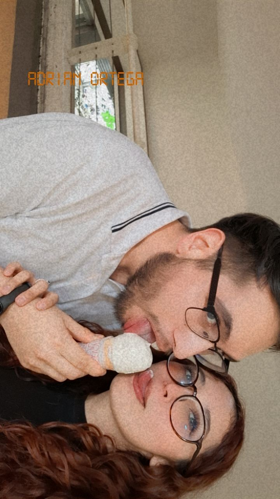

<!DOCTYPE html>
<html lang="es">
<head>
    <meta charset="UTF-8">
    <meta name="viewport" content="width=device-width, initial-scale=1.0">
    <title>¿Quieres ser mi cita?</title>
    
</head>
<body>
    
    <h2 id="question">¿Quieres ser mi cita este 14 de febrero?</h2>
    <button class="yes" onclick="sayYes()">Sí</button>
    <button class="no" onclick="sayNo()">No</button>

    

        <h2>¡Sabía que dirías que sí! ¡Te amo!</h2>
        <button onclick="showAlbum()">A continuación, un álbum de fotos</button>
    

    

        
        <button id="nextButton" onclick="nextPhoto()">Siguiente</button>
    

    
</body>
</html>
